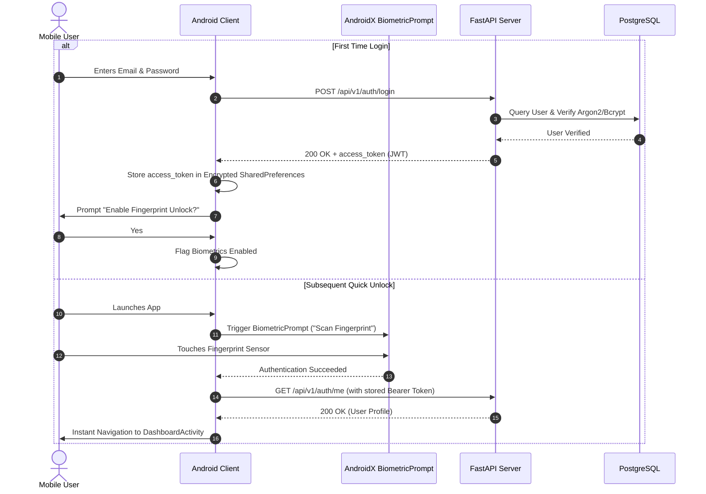

# FinTrack Mobile — Complete Android Frontend Requirements Specification & Stitch Design Spec (DESIGN.md)

> **Document Version:** 2.0.0 (Production Master)  
> **Platform Target:** Native Android Mobile (Material Design 3 / Pure Java 17-22)  
> **Target Devices:** Android 7.0+ (API Level 24 to 34), Portrait Form Factors (390x844 / 412x915 dp)  
> **Design Language:** Dark Slate Modern & Emerald Green Accent with Glassmorphic Micro-Elevations  
> **Backend Architecture:** FastAPI + SQLAlchemy 2.x + PostgreSQL (Synchronous Session, Controller→Service→Repository→Model)

---

## 📑 Table of Contents
1. [Executive Summary & Product Architecture](#1-executive-summary--product-architecture)
2. [Entities, Data Models & Business Logic](#2-entities-data-models--business-logic)
3. [Complete CRUD Operations Matrix](#3-complete-crud-operations-matrix)
4. [Authentication & Security Workflows](#4-authentication--security-workflows)
5. [End-to-End User Journeys (7 Core Workflows)](#5-end-to-end-user-journeys)
6. [Complete REST API Contracts (35+ Endpoints)](#6-complete-rest-api-contracts)
7. [10 AI Super-Features Suite Specifications](#7-10-ai-super-features-suite-specifications)
8. [UI/UX Design System & Screen Specifications (Stitch-Ready)](#8-uiux-design-system--screen-specifications)
9. [Android Non-Functional & Technical Requirements](#9-android-non-functional--technical-requirements)

---

## 🏛️ 1. Executive Summary & Product Architecture

FinTrack is an AI-powered personal financial intelligence and wealth management application. The Android native application serves as the primary mobile client, interacting with a centralized FastAPI backend via JWT-authenticated REST APIs.

```
┌─────────────────────────────────────────────────────────────────────────────┐
│                            FINTRACK ANDROID APP                             │
│  Activities & Fragments (ViewBinding) ➔ Retrofit 2 ➔ OkHttp (AuthInterceptor)│
└──────────────────────────────────────┬──────────────────────────────────────┘
                                       │ HTTP / JSON (Bearer JWT)
                                       ▼
┌─────────────────────────────────────────────────────────────────────────────┐
│                          FASTAPI BACKEND SYSTEM                             │
│  Controller (HTTP/Pydantic) ➔ Service (Logic) ➔ Repository ➔ PostgreSQL DB   │
│                             └─ Multi-Model AI Engine (Gemini/OpenAI/Groq)   │
└─────────────────────────────────────────────────────────────────────────────┘
```

---

## 🗄️ 2. Entities, Data Models & Business Logic

### 2.1 User (`users`)
- **Attributes:** `id` (int), `email` (string), `display_name` (string), `hashed_password` (string), `google_id` (string, optional), `is_verified` (boolean), `is_active` (boolean), `is_admin` (boolean), `created_at` (timestamp), `updated_at` (timestamp).
- **Business Rules:**
  - Email must be unique and valid format.
  - Unverified users cannot log in (blocked until token verification).
  - On user creation, default categories (Food, Transport, Bills, Shopping, Entertainment) and default wallets (Main Bank, Cash in Hand) are automatically seeded.

### 2.2 Category (`categories`)
- **Attributes:** `id` (int), `user_id` (int), `name` (string, max 50 chars), `created_at` (timestamp).
- **Business Rules:**
  - Scoped strictly to `user_id`. Category names are unique per user (case-insensitive).
  - Deleting a category with associated expenses moves or preserves expense referential integrity based on business policy.

### 2.3 Payment Method (`payment_methods`)
- **Attributes:** `id` (int), `name` (string), `is_predefined` (boolean).
- **Predefined Methods:** `Cash`, `Card`, `UPI`, `Net Banking`, `Wallet`.

### 2.4 Expense (`expenses`)
- **Attributes:** `id` (int), `user_id` (int), `title` (string, max 100 chars), `amount` (decimal 10,2), `date` (date string `YYYY-MM-DD`), `category_id` (int), `payment_method_id` (int), `wallet_id` (int, optional), `notes` (text, optional), `created_at` (timestamp).
- **Business Rules:**
  - `amount` must be `> 0.00`.
  - `date` must be `<= today` (cannot record future expenses).
  - If `wallet_id` is provided:
    - **Creation:** Automatically deducts `amount` from wallet balance.
    - **Update:** Refunds old amount to previous wallet and deducts new amount from updated wallet.
    - **Deletion:** Automatically refunds `amount` back to the linked wallet balance.

### 2.5 Wallet / Account (`wallets`)
- **Attributes:** `id` (int), `user_id` (int), `name` (string, max 50 chars), `wallet_type` (`BANK`, `CASH`, `UPI`, `CREDIT_CARD`, `SAVINGS`, `OTHER`), `balance` (decimal 12,2), `currency` (`INR`), `color` (hex string, e.g. `#10B981`), `icon` (string identifier), `is_default` (boolean), `created_at` (timestamp).
- **Business Rules:**
  - `Net Worth = Sum(Liquid Assets: Bank + Cash + UPI + Savings) - Sum(Liabilities: Credit Card Balance)`.
  - Adding money / Top-up updates balance and records a `DEPOSIT` transaction log.
  - Deleting a wallet deletes or archives associated ledger records.

### 2.6 Wallet Transaction Ledger (`wallet_transactions`)
- **Attributes:** `id` (int), `wallet_id` (int), `user_id` (int), `transaction_type` (`DEPOSIT`, `EXPENSE`, `TRANSFER_IN`, `TRANSFER_OUT`, `REFUND`), `amount` (decimal 12,2), `destination_wallet_id` (int, optional), `description` (string), `transaction_date` (timestamp).
- **Business Rules:**
  - Inter-account transfers create twin double-entry records: `TRANSFER_OUT` on source and `TRANSFER_IN` on destination atomically.

### 2.7 Budget (`budgets`)
- **Attributes:** `id` (int), `user_id` (int), `category_id` (int, optional; `null` = overall monthly budget), `amount_limit` (decimal 10,2), `period` (`monthly`, `daily`), `created_at` (timestamp).
- **Health State Computation:**
  - `percentage_spent = (current_month_spent / amount_limit) * 100`.
  - `On Track` 🟢: `< 70%`.
  - `Near Limit` 🟡: `70% - 99%`.
  - `Over Budget` 🔴: `>= 100%`.

### 2.8 Debt & Udhaar (`debts`)
- **Attributes:** `id` (int), `user_id` (int), `person_name` (string), `debt_type` (`LENT` [Receivable], `BORROWED` [Payable]), `initial_amount` (decimal 10,2), `remaining_amount` (decimal 10,2), `due_date` (date string `YYYY-MM-DD`, optional), `notes` (text), `status` (`ACTIVE`, `SETTLED`), `created_at` (timestamp).
- **Business Rules:**
  - Repayments subtract from `remaining_amount`. When `remaining_amount == 0.00`, `status` automatically flips to `SETTLED`.

### 2.9 Debt Repayment (`debt_repayments`)
- **Attributes:** `id` (int), `debt_id` (int), `amount` (decimal 10,2), `notes` (text), `repayment_date` (date string).

---

## ⚡ 3. Complete CRUD Operations Matrix

| Entity | Create (POST) | Read / Query (GET) | Update (PUT) | Delete (DELETE) |
|---|---|---|---|---|
| **Auth / User** | Register (`/auth/register`) | Profile (`/auth/me`) | Change Password (`/auth/change-password`) | N/A |
| **Expenses** | Add Expense (`/expenses`) | List w/ Filter+Pagination (`/expenses`), Details (`/expenses/{id}`) | Edit Expense (`/expenses/{id}`) | Delete & Refund (`/expenses/{id}`) |
| **Categories** | New Category (`/categories`) | List User Categories (`/categories`) | Rename (`/categories/{id}`) | Delete (`/categories/{id}`) |
| **Wallets** | New Account (`/wallets`) | Summary (`/wallets/summary`), List (`/wallets`) | Edit Details (`/wallets/{id}`) | Delete Account (`/wallets/{id}`) |
| **Wallet Top-Up**| Deposit (`/wallets/{id}/deposit`)| Transactions (`/wallets/{id}/transactions`), All (`/wallets/transactions/all`) | N/A | N/A |
| **Transfers** | Inter-Account Transfer (`/wallets/transfer`) | Reflected in Transaction Ledger | N/A | N/A |
| **Budgets** | Set Limit (`/budgets`) | List with Live Spend (`/budgets`) | Update Cap (`/budgets/{id}`) | Delete (`/budgets/{id}`) |
| **Debts** | Create Udhaar (`/debts`) | Summary (`/debts/summary`), List (`/debts`) | Edit Debt (`/debts/{id}`) | Delete (`/debts/{id}`) |
| **Repayments** | Log Repayment (`/debts/{id}/repayments`) | In Debt Details | N/A | Delete Log (`/debts/{id}/repayments/{r_id}`) |
| **AI Modules** | Roast, OCR, Chat, Insights, Forecast, Subscriptions, Goal-Plan | Real-time computed via AI Engine | N/A | N/A |

---

## 🔐 4. Authentication & Security Workflows



### Security Safeguards
1. **Network Interceptor:** `AuthInterceptor` automatically attaches `Authorization: Bearer <token>` to all HTTP requests except `/auth/login`, `/auth/register`, and `/health`.
2. **401 Token Expiration Handler:** If API returns `401 Unauthorized`, clear local session token and seamlessly redirect user to `LoginActivity`.
3. **No Hardcoded Secrets:** All base URLs and client IDs injected via `BuildConfig` and `Constants.java`.

---

## 🗺️ 5. End-to-End User Journeys

### Journey 1: Onboarding, Dual Auth & Biometric Activation
1. User installs and opens FinTrack Android app.
2. User sees branded splash screen and is presented with `LoginActivity`.
3. User selects *"Sign Up"*, enters Name, Email, and Password.
4. App dispatches verification link. Upon email confirmation, user enters credentials.
5. On successful login, app prompts for Fingerprint enrollment. User touches sensor; credentials securely mapped. Subsequent app launches bypass password form.

### Journey 2: Expense Logging & AI Camera OCR Scanning
1. User receives a physical printed invoice at a restaurant.
2. User taps `+` FAB or *"Add Expense"* on Home Dashboard.
3. User taps top header button: **"📷 Scan Bill / Receipt with AI"**.
4. User selects *"Take Photo with Camera"*. Android runtime permission requested if not yet granted.
5. Camera launches via `FileProvider`. User snaps photo of receipt.
6. Android client captures full-resolution JPEG, downscales to 1024x1024, encodes to Base64, and dispatches to `POST /api/v1/ai/scan-receipt`.
7. Google Gemini AI extracts: Amount (`₹1,450.00`), Date (`2026-09-10`), Title (`"Mainland China Restaurant"`), Category (`"Food & Dining"`), and Merchant Name.
8. Form fields auto-fill with a visual highlight. User confirms source wallet and taps *"Save Expense"*.
9. Expense is saved, wallet balance automatically deducted, and user redirected with instant UI toast.

### Journey 3: Multi-Account Management, Instant Top-Up & Transfer
1. User navigates to **Wallets** tab.
2. User views total Net Worth (`₹1,84,500`), Liquid Cash (`₹2,10,000`), and Credit Card Dues (`₹25,500`).
3. User taps `+ Add Money` on *HDFC Salary Account*.
4. Top-Up dialog opens: User taps quick chip `+₹10,000` and selects reason tag `Monthly Salary`. Live preview shows balance transitioning from `₹1,45,000 ➔ ₹1,55,000`.
5. User confirms deposit. API updates balance and writes ledger record.
6. User taps `⇄ Transfer`, selects `From: HDFC Salary` ➔ `To: Cash in Hand`, enters `₹3,000`. Double-entry transfer completes atomically.

### Journey 4: Budget Limits & Spend Health Monitoring
1. User navigates to **Budgets** tab.
2. User sees overall monthly health bar and category-wise spending cards.
3. User views AI recommendation card: *"AI suggests setting Shopping budget to ₹5,000 to save ₹1,800 this month"*.
4. User taps `+ Set Budget`, selects Category *"Entertainment"*, and enters limit `₹4,000`.
5. As expenses are logged, progress bars dynamically shift colors: Emerald (`<70%`), Amber (`70-99%`), and Flame Red (`>=100%`) with alert notifications.

### Journey 5: Udhaar / Debt Tracking & Partial Repayment
1. User navigates to **Debts** tab.
2. Top summary cards immediately display: **You Lent:** `₹14,500` (Receivable) vs **You Borrowed:** `₹6,000` (Payable).
3. User filters by *"Lent"* tab to see friend *"Rahul Sharma"* who owes `₹5,000` for a Goa trip.
4. Friend pays back `₹2,500` via UPI. User taps *"Record Payment"* on the card.
5. Dialog opens, user enters `₹2,500` with note *"Received UPI part 1"*.
6. Remaining amount instantly recalculates to `₹2,500`, progress bar updates to 50% paid, and repayment history logs timestamp.

### Journey 6: AI Spending Roast & Conversational Financial QA
1. On Home dashboard, user views the **🔥 AI Spending Roast** card.
2. Slogan reads: `"Crorepati vibes on a pocket-money budget! 📉"`.
3. User taps *"Why this roast? View explanation ▼"*. The card smoothly expands to reveal Gemini's roast: *"You ordered Zomato 14 times this week while groceries are rotting in your fridge!"*.
4. User taps *"💬 Talk Back"*, which launches the full-screen **AI Financial Assistant**.
5. User asks: *"Bhai mai agle mahine Goa jaane ke liye 15,000 kaise bacha sakta hu?"*.
6. AI assistant analyzes user's live budget and top spending categories, and outputs an actionable 3-step cutback plan in Hinglish.

---

## 🔌 6. Complete REST API Contracts

### 6.1 Authentication Module

#### `POST /api/v1/auth/register`
- **Headers:** `Content-Type: application/json`
- **Request Body:**
```json
{
  "email": "user@fintrack.app",
  "password": "StrongPassword123!",
  "display_name": "Samarth Dhute"
}
```
- **Response `201 Created`:**
```json
{
  "message": "Registration successful. Please check your email to verify your account."
}
```

#### `POST /api/v1/auth/login`
- **Request Body:**
```json
{
  "email": "user@fintrack.app",
  "password": "StrongPassword123!"
}
```
- **Response `200 OK`:**
```json
{
  "access_token": "eyJhbGciOiJIUzI1NiIsIn...",
  "token_type": "bearer",
  "user": {
    "id": 1,
    "email": "user@fintrack.app",
    "display_name": "Samarth Dhute",
    "is_verified": true
  }
}
```

#### `POST /api/v1/auth/forgot-password`
- **Request Body:** `{"email": "user@fintrack.app"}`
- **Response `200 OK`:** `{"message": "Password reset instructions sent to your email"}`

#### `POST /api/v1/auth/change-password`
- **Headers:** `Authorization: Bearer <token>`
- **Request Body:**
```json
{
  "current_password": "OldPassword123!",
  "new_password": "NewPassword456!"
}
```
- **Response `200 OK`:** `{"message": "Password changed successfully"}`

---

### 6.2 Dashboard & KPI Module

#### `GET /api/v1/dashboard/summary`
- **Headers:** `Authorization: Bearer <token>`
- **Response `200 OK`:**
```json
{
  "total_spending": 24500.00,
  "month_over_month_change_pct": -8.5,
  "today_spending": 650.00,
  "burn_rate_daily": 816.66,
  "recent_expenses": [
    {
      "id": 101,
      "title": "Grocery Supermarket",
      "amount": 1450.00,
      "date": "2026-09-10",
      "category_id": 3,
      "category_name": "Food & Groceries",
      "payment_method_name": "UPI",
      "wallet_id": 1,
      "wallet_name": "Main Bank"
    }
  ]
}
```

#### `GET /api/v1/dashboard/charts/category`
- **Response `200 OK`:**
```json
[
  {"category_id": 1, "category_name": "Food & Dining", "total_amount": 8200.00, "percentage": 33.4},
  {"category_id": 2, "category_name": "Shopping", "total_amount": 5400.00, "percentage": 22.0},
  {"category_id": 3, "category_name": "Transport", "total_amount": 3100.00, "percentage": 12.6}
]
```

---

### 6.3 Wallets & Accounts Module

#### `GET /api/v1/wallets/summary`
- **Response `200 OK`:**
```json
{
  "total_net_worth": 184500.00,
  "liquid_balance": 210000.00,
  "credit_liabilities": 25500.00,
  "wallets_count": 4
}
```

#### `GET /api/v1/wallets`
- **Response `200 OK`:**
```json
[
  {
    "id": 1,
    "name": "HDFC Salary Bank",
    "wallet_type": "BANK",
    "balance": 145000.00,
    "currency": "INR",
    "color": "#3B82F6",
    "icon": "bank",
    "is_default": true
  },
  {
    "id": 2,
    "name": "Cash in Hand",
    "wallet_type": "CASH",
    "balance": 8500.00,
    "currency": "INR",
    "color": "#10B981",
    "icon": "cash",
    "is_default": false
  }
]
```

#### `POST /api/v1/wallets/{id}/deposit` (Top-Up)
- **Request Body:**
```json
{
  "amount": 5000.00,
  "description": "Monthly Salary",
  "tag": "SALARY"
}
```
- **Response `200 OK`:**
```json
{
  "wallet_id": 1,
  "previous_balance": 145000.00,
  "new_balance": 150000.00,
  "message": "Top-up of ₹5,000.00 successful"
}
```

#### `POST /api/v1/wallets/transfer` (Inter-Account Transfer)
- **Request Body:**
```json
{
  "source_wallet_id": 1,
  "destination_wallet_id": 2,
  "amount": 2000.00,
  "description": "ATM Cash Withdrawal"
}
```
- **Response `200 OK`:**
```json
{
  "status": "success",
  "message": "Transferred ₹2,000.00 from HDFC Salary Bank to Cash in Hand"
}
```

#### `GET /api/v1/wallets/transactions/all`
- **Response `200 OK`:**
```json
[
  {
    "id": 501,
    "wallet_id": 1,
    "transaction_type": "DEPOSIT",
    "amount": 5000.00,
    "description": "Monthly Salary",
    "transaction_date": "2026-09-10T10:15:30Z"
  },
  {
    "id": 502,
    "wallet_id": 1,
    "transaction_type": "TRANSFER_OUT",
    "amount": 2000.00,
    "destination_wallet_id": 2,
    "description": "ATM Cash Withdrawal",
    "transaction_date": "2026-09-10T11:00:00Z"
  }
]
```

---

### 6.4 Expenses & Categories Module

#### `GET /api/v1/expenses?search=&category_id=&payment_method_id=&wallet_id=&start_date=&end_date=&skip=0&limit=50`
- **Response `200 OK`:**
```json
{
  "items": [
    {
      "id": 204,
      "title": "Fuel Petrol",
      "amount": 800.00,
      "date": "2026-09-09",
      "category_id": 4,
      "category_name": "Transport",
      "payment_method_id": 3,
      "payment_method_name": "Card",
      "wallet_id": 1,
      "wallet_name": "HDFC Salary Bank",
      "notes": "Full tank bike"
    }
  ],
  "total": 45
}
```

#### `POST /api/v1/expenses`
- **Request Body:**
```json
{
  "title": "Starbucks Coffee",
  "amount": 350.00,
  "date": "2026-09-10",
  "category_id": 3,
  "payment_method_id": 2,
  "wallet_id": 1,
  "notes": "Merchant: Starbucks"
}
```
- **Response `201 Created`:**
```json
{
  "id": 205,
  "title": "Starbucks Coffee",
  "amount": 350.00,
  "wallet_balance_deducted": true
}
```

#### `GET /api/v1/categories`
- **Response `200 OK`:**
```json
[
  {"id": 1, "name": "Food & Dining", "expense_count": 18},
  {"id": 2, "name": "Shopping", "expense_count": 9},
  {"id": 3, "name": "Transport", "expense_count": 12},
  {"id": 4, "name": "Bills & Utilities", "expense_count": 4}
]
```

---

### 6.5 Debts & Udhaar Module

#### `GET /api/v1/debts/summary`
- **Response `200 OK`:**
```json
{
  "total_lent_receivable": 14500.00,
  "total_borrowed_payable": 6000.00,
  "active_debts_count": 5
}
```

#### `GET /api/v1/debts`
- **Response `200 OK`:**
```json
[
  {
    "id": 12,
    "person_name": "Rahul Sharma",
    "debt_type": "LENT",
    "initial_amount": 5000.00,
    "remaining_amount": 2500.00,
    "due_date": "2026-09-25",
    "notes": "Goa trip hotel booking",
    "status": "ACTIVE",
    "created_at": "2026-09-01T12:00:00Z"
  }
]
```

#### `POST /api/v1/debts`
- **Request Body:**
```json
{
  "person_name": "Amit Verma",
  "debt_type": "BORROWED",
  "initial_amount": 3000.00,
  "due_date": "2026-09-30",
  "notes": "Emergency cash"
}
```
- **Response `201 Created`:** `{"id": 13, "person_name": "Amit Verma", "remaining_amount": 3000.00}`

#### `POST /api/v1/debts/{debt_id}/repayments`
- **Request Body:**
```json
{
  "amount": 1500.00,
  "notes": "UPI payment part 1",
  "repayment_date": "2026-09-10"
}
```
- **Response `200 OK`:**
```json
{
  "debt_id": 13,
  "repayment_id": 4,
  "amount_paid": 1500.00,
  "remaining_amount": 1500.00,
  "status": "ACTIVE"
}
```

---

## 🧠 7. 10 AI Super-Features Suite Specifications

### 1. 🔥 AI Spending Roast (`POST /api/v1/ai/roast`)
- **UI Behavior:** Home screen card shows punchline and burn level badge. Detailed explanation is collapsed by default. Clicking *"Why this roast? View explanation ▼"* expands the card.
- **Sample Response:**
```json
{
  "burn_level": "Spicy 🔥🔥",
  "punchline": "Crorepati vibes on a pocket-money budget! 📉",
  "roast": "You ordered Zomato 14 times this week while having groceries rotting in your fridge. At this rate, your bank statement is basically a food delivery menu!"
}
```

### 2. 📷 AI Camera Receipt / Bill Scanner (`POST /api/v1/ai/scan-receipt`)
- **UI Behavior:** Native Android Camera captures full-res image via `FileProvider`. Client downscales to 1024x1024 Base64. Gemini AI parses image and auto-fills Amount, Date, Title, Merchant, and Category in Add Expense screen.
- **Request Body:** `{"image_base64": "<base64_string>", "mime_type": "image/jpeg"}`
- **Sample Response:**
```json
{
  "amount": 1280.00,
  "title": "Decathlon Sports Shoes",
  "date": "2026-09-10",
  "merchant_name": "Decathlon Sports India",
  "category_id": 5,
  "category_name": "Shopping",
  "confidence": 0.96
}
```

### 3. ⚡ Real-Time Smart Auto-Categorization (`POST /api/v1/ai/categorize`)
- **UI Behavior:** Debounced 400ms listener on Expense Title input. Shows an animated pill badge with suggested category and payment method.
- **Request Body:** `{"title": "Uber ride to airport"}`
- **Sample Response:**
```json
{
  "category_id": 4,
  "category_name": "Transport",
  "confidence": 0.98,
  "suggested_payment_method": "UPI"
}
```

### 4. 💬 Conversational Financial Assistant (`POST /api/v1/ai/chat`)
- **UI Behavior:** Floating full-screen / bottom modal drawer with quick prompt chips, voice dictation, and live user context injection (MoM change, budgets, category distribution).
- **Request Body:** `{"message": "Bhai mere top kharche kya hain aur mai 5000 kaise bacha sakta hu?"}`
- **Sample Response:**
```json
{
  "reply": "Aapke is mahine ke top kharche: 🍔 Food (₹8,200) aur 🛍️ Shopping (₹5,400).\n\n💡 5,000 bachaane ke 2 simple steps:\n1. Dining out ko 40% kam karke ₹3,200 bachega.\n2. Inactive subscriptions cancel karein."
}
```

### 5. 📊 AI Health Score & Budget Recommendations (`POST /api/v1/ai/insights`)
- **UI Behavior:** 0-100 gauge score with dynamic status badge (*Living Large*, *Needs Attention*, *Critical*) and category budget cutback recommendations.
- **Sample Response:**
```json
{
  "health_score": 84,
  "health_status": "Good",
  "insights": [
    "Your savings rate is 28%, which is above average.",
    "Food spending surged 18% compared to last week."
  ],
  "budget_recommendations": [
    {
      "category_name": "Food & Dining",
      "current_spent": 9400.00,
      "recommended_limit": 8000.00,
      "estimated_monthly_saving": 1400.00
    }
  ]
}
```

### 6. 🔮 Month-End Predictive Forecast (`GET /api/v1/ai/forecast`)
- **UI Behavior:** Daily run-rate pacing calculator and comparison against previous month burn.
- **Sample Response:**
```json
{
  "current_spent": 14200.00,
  "daily_run_rate": 835.00,
  "predicted_month_end": 25050.00,
  "mom_comparison_pct": -6.2,
  "pacing_status": "ON_TRACK"
}
```

### 7. 🔄 Recurring Subscriptions & Fixed Burn Detector (`GET /api/v1/ai/subscriptions`)
- **UI Behavior:** Automatic detection of Netflix, Spotify, gym, rent, and recurring monthly commitments.
- **Sample Response:**
```json
{
  "recurring_items": [
    {"merchant": "Netflix India", "amount": 649.00, "frequency": "MONTHLY"},
    {"merchant": "Cult Fit Gym", "amount": 2500.00, "frequency": "MONTHLY"}
  ],
  "total_monthly_burn": 3149.00
}
```

### 8. 🎯 Goal-Based Savings Planner (`POST /api/v1/ai/goal-plan`)
- **UI Behavior:** Interactive simulator (*"Save ₹50,000 in 6 months"*) with category cutback breakdown and feasibility scoring.
- **Request Body:** `{"target_amount": 50000.00, "months": 6}`
- **Sample Response:**
```json
{
  "monthly_saving_required": 8333.33,
  "feasibility_score": 85,
  "cutback_recommendations": [
    {"category": "Entertainment", "cutback_pct": 30, "monthly_savings": 2000.00},
    {"category": "Dining Out", "cutback_pct": 25, "monthly_savings": 3500.00}
  ]
}
```

### 9. ⚠️ Anomaly & Overspending Alerts
- Real-time detection of spending spikes and budget breach warnings.

### 10. 💡 Personalized 50/30/20 Saving Tips
- Algorithmic analysis of Needs (50%), Wants (30%), and Savings (20%) allocation.

---

## 🎨 8. UI/UX Design System & Screen Specifications

### 8.1 Color & Surface Tokens
- `Primary Emerald`: `#10B981` (CTA, Lent, Success)
- `Primary Dark`: `#059669` (Pressed States, Gradients)
- `Slate Dark Base`: `#0B132B` (App Background Dark)
- `Slate Surface`: `#1C2541` (Cards & Dialogs Dark)
- `Surface White`: `#FFFFFF` (Card Light)
- `Roast Flame Orange`: `#EA580C` (AI Roast Accent)
- `Roast Peach Background`: `#FFF7ED` (Roast Card Surface)
- `Danger Coral`: `#EF4444` (Expenses, Borrowed, Over Budget)
- `Warning Amber`: `#F59E0B` (Near Budget Limit)
- `Info Blue`: `#3B82F6` (Bank Accounts, Top-Up)

### 8.2 9 Canonical Screens for Stitch Generation

1. **`fintrack-login`**: Dark slate authentication screen with email/password inputs, biometric fingerprint circle button, and Google OAuth.
2. **`fintrack-dashboard-home`**: Mobile dashboard with Emerald Net Worth card, quick actions, compact orange AI Roast card with slogan and dropdown toggle, spending pace meter, and accounts list.
3. **`fintrack-expenses-list`**: Clean expense ledger with top search bar, horizontal category filter chips, expense list items with wallet badges, and FAB.
4. **`fintrack-add-expense`**: Form with large amount input, "📷 Scan Bill with AI" header button, real-time AI category suggestion chip, category/wallet spinners, and date picker.
5. **`fintrack-wallets-accounts`**: Accounts overview with Net Worth header, multi-wallet grid, "+ Add Money Top-Up" dialog with quick chips (+₹500, +₹1k, +₹5k), and transaction ledger.
6. **`fintrack-budgets-overview`**: Category budget limits with color-coded health indicators (On Track, Near Limit, Over Budget) and AI budget recommendation cards.
7. **`fintrack-debts-ledger`**: Udhaar tracking with You Lent (Green) vs You Borrowed (Red) summary cards, All/Lent/Borrowed filter pills, and Record Repayment modal.
8. **`fintrack-ai-hub`**: AI Intelligence Hub with 0-100 financial health speedometer gauge, predictive month-end projection, recurring subscriptions list, and Goal Planner.
9. **`fintrack-ai-chat-modal`**: Conversational financial assistant drawer with quick prompt chips (Roast My Spending, Save ₹5,000), voice mic button, and message bubbles.

---

## 🛠️ 9. Android Non-Functional & Technical Requirements

1. **Pure Java Architecture:** Compatible with Java 17, 21, and 22 without Kotlin runtime overhead.
2. **Offline Resilience:** Cached token in `SharedPreferences`. Graceful error handling on network disconnects with retry toasts.
3. **Hardware Biometrics:** Implementation of `androidx.biometric.BiometricPrompt` supporting both Fingerprint and Face Unlock hardware authenticators.
4. **Camera & FileProvider:** Compliant with Android 14 Scoped Storage and runtime permissions. Temporary files stored in app-specific cache directory and cleared after OCR processing.
5. **Fast Startup Time:** Cold start `< 1.2 seconds` on mid-tier hardware (e.g. Samsung Galaxy A14 5G).
6. **Production APK Optimization:** R8 minification and resource shrinking reducing standalone APK footprint to `< 4.0 MB`.
